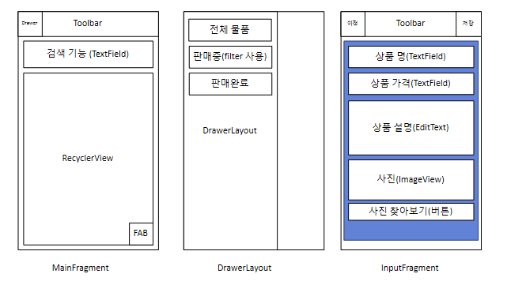
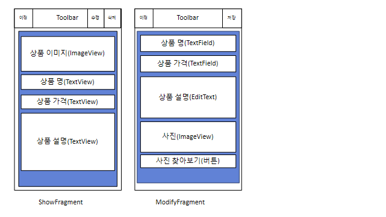
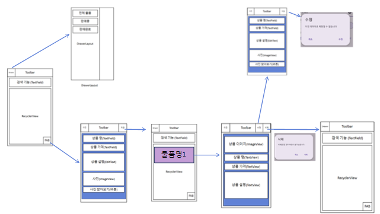

# 물건 관리 앱

---

## 구성 화면

---

## ID 설정
fragment_item_list.xml
- toolbarItemList
- recyclerViewItemList
- fabItemListAdd

fragment_add_item.xml
- toolbarAddItem
- textInputLayoutName
- textInputLayoutPrice
- textInputLayoutAbout
- toggleInputSellingOrSold
- buttonInputSelling
- buttonInputSold
- imageAddView
- buttonInputSearchphoto

fragment_read_item.xml
- toolbarReadItem
- textFieldReadItemName
- textFieldReadItemPrice
- textFieldReadItemAbout

fragment_modify_item.xml
- toolbarModifyItem
- textModifyLayoutName
- textModifyLayoutPrice
- textModifyLayoutAbout
- toggleModifySellingOrSold
- buttonModifySelling
- buttonModifySold
- imageModifyView
- buttonModifySearchphoto

toolbar_add_item_menu
- toolbar_add_item_check

toolbar_read_item_menu
- toolbar_read_menu_item_delete
- toolbar_read_menu_item_delete

---

## 구현 해야할 기능
- 물건 관리(등록, 수정, 삭제, 물건 검색 등등)
- 물건의 사진을 등록할 수 있게 만들어 주면 기본 30점짜리
- 사진 데이터는 파일 입출력을 통해 저장
- 물건 데이터는 SQLiteDatabase에 저장한다.  -> 20점짜리
- RoomDatabase를 사용 -> 30점짜리
- 어떠한 기능들을 구현하였는지 -> 10점
- 화면 구성 -> 10점

---

### ItemListFragment
- Toolbar -> 목록, 검색
- RecycleView
- FAB 버튼 -> 추가

### DrawerLayout
- 전체 제품 목록
- 판매중인 제퓸
- 판매된 제품

### AddItemFragment
- Toolbar -> 뒤로가기, 저장
- scrollView 사용
- TextField (상품 명)
- TextField (상품 가격)
- TextField (상품 설명)
- ImageView (상품 사진 보여주기)
- Button(사진 찾아보기)

### ReadItemFragment
- Toolbar -> 뒤로가기, 수정, 삭제
- scrollView 사용
- TextView (상품 명)
- TextView (상품 가격)
- TextView (상품 설명)
- ImageView (상품 이미지)

### ModifyItemFragment
- Toolbar -> 뒤로가기, 저장
- scrollView 사용
- TextField (상품 명)
- TextField (상품 가격)
- TextField (상품 설명)
- ImageView (상품 사진 보여주기)
- Button(사진 찾아보기)

### FilterSellingFragment
- Toolbar - 목록
- RecycleView

### FilterSoldFragment
- Toolbar - 목록
- RecycleView

### SearchItemFragment
- Toolbar - 뒤로가기
- TextField (검색)
- RecycleView